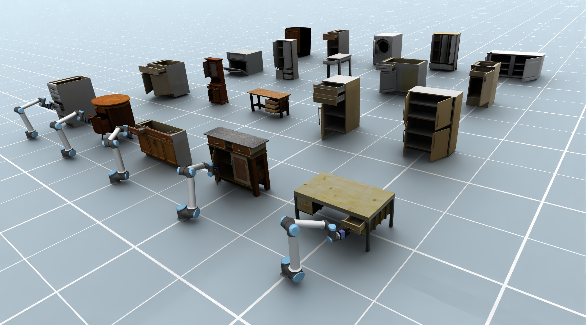

# PAct: Part-Decomposed Single-View Articulated Object Generation
###  Anonymous Authors
<!-- ## [Project page (preparing)](https://pact-project.github.io/) | [HuggingFaceDemo](https://pact-project.github.io/) | -->
<a href="https://pact-project.github.io/"></a>
<a href="https://huggingface.co/PAct000/PAct"></a>
<a href="https://huggingface.co/spaces/PAct000/PAct"></a>

<!-- <a href="LICENSE"></a> -->


Given a single image, **PAct** generates an articulated 3D object by predicting a part-decomposed structure, synthesizing high-fidelity part geometry and appearance, and estimating articulation parameters for physics-based simulation.
This repository currently focuses on inference with the `PActPipeline`, while the full training stack is being cleaned up for release. This README walks through environment setup, running inference, tuning parameters, and our roadmap for opening the remaining pieces.


## 1. Open-Source Timeline

| Stage | Deliverable | Target Date | Notes |
| --- | --- | --- | --- |
| Inference Release | Cleaned `infer_imgs.py`, pretrained checkpoints, sample configs. | 2026-02-07 | ✅ available now. |
| Dataset Recipes | Detailed docs + scripts for preparing datasets. | 2026-05-01 | In progress. |
| Training Stage 1 | Sparse-structure (SS-Flow) training scripts + configs. | 2026-05-01 | In progress.  |
| Training Stage 2 | SLAT articulation training pipeline + evaluation metrics. | 2026-05-01 |In progress.  |


Dates reflect our best-effort plan; we will update this table and tag releases in the repo as milestones land.


## 2. Environment Setup

1. **Clone**
	```bash
	git clone https://github.com/PAct-project/PAct.git
	cd PAct
	```
2. **Conda environment (recommended, we follow the TRELLIS repo)**
	```bash
	conda env create -f PAct_env.yml
	conda activate PAct
	```

## 3. Launch Gradio Demo

```bash
python app.py
```
For convenience, we provide a Hugging Face demo that also allows downloading exported URDFs. The exported URDF files can be viewed in VS-Code with [URDF Visualizer](https://marketplace.visualstudio.com/items?itemName=morningfrog.urdf-visualizer)
## 4. Inference via scritps


### 4.1 Running Inference

Call the batch inference script with your config and overrides:

```bash
python infer_imgs.py \
  --config configs/generation/example.json \
  --data_dir assets/real_world_examples \
  --outdir outputs/real_world \
  --batch_size 2 \
  --save_glb --export_arti_objects --test_only
```

Results (videos, GLBs, Gaussian splats, logs) are written under the `--outdir` folder in subdirectories named with your sampling configuration and random seed.

### 4.2 Key Arguments

`infer_imgs.py` exposes every previously hard-coded hyperparameter as a CLI flag. Important options are summarized below (see [infer_imgs.py](infer_imgs.py) for the full list):

| Flag | Purpose | Default |
| --- | --- | --- |
| `--ss_steps`, `--slat_steps` | Sampler iterations for sparse structure / SLAT stages. | `25`, `25` |
| `--ss_cfg_strength`, `--slat_cfg_strength` | Guidance strength for each sampler. | `7.0`, `7.0` |
| `--explode_coords_ratio`, `--gaussian_explosion_scale` | Explosion used when visualizing voxels or Gaussians. | `0.5`, `0.3` |
| `--render_num_frames`, `--render_radius`, `--render_fov`, `--render_bg_color` | Camera sweep + appearance of rendered videos. | `60`, `2.3`, `60`, `(1,1,1)` |
| `--video_fps`, `--grid_size`, `--save_video_grid`, `--save_cond_vis_grid` | Control mosaic layout and playback speed when saving videos/images. | `20`, `4`, enabled |
| `--save_glb`, `--save_gs`, `--export_arti_objects` | Toggle mesh/splat export to SINGAPO/URDF formats. | disabled |
| `--mesh_simplify_ratio`, `--texture_size`, `--textured_mesh` | Mesh post-processing knobs when `--save_glb` is set. | `0.95`, `1024`, enabled |

Every argument can also be specified inside the JSON config; CLI values take precedence.

### 4.3 Output Layout

Each inference batch produces:

- `grid_vids_samples_videos_*`: Articulation and exploded-part video mosaics.
- `grids_cond_vis_*`: Conditioning image grids.
- `*_arti_animation*.mp4`, `*exploded_part*.mp4/png`: Per-object renders when mosaics are disabled.
- `run_command.txt`: Command provenance for reproducibility.
- `exported_arti_objects`: Optional GLB/Gaussian assets and articulation info if the corresponding flags are enabled.

### 4.4 Export Articulated Object to URDFs

Use the helper script to convert every `object.json` in an exported inference run into URDF files ( must set `--export_arti_objects` in Sec. 4.1):

```bash
python scripts/batch_json_to_urdf.py \
	--exported_art_objs_dir outputs/<run_name>/exported_arti_objects
```

Each generated URDF is placed next to its source metadata as `<object_name>_fromJson2urdf.urdf`.

## 3. Training 
### 3.1 Dataset-processing
TBD 
### 3.2 Training-guidance
TBD 


## 4. Contributing & Support


## 5. Citation

If you build upon this work, please cite the PAct paper / project page (bibtex to be added with the formal release):

Happy hacking and let us know what you build! 🎉
